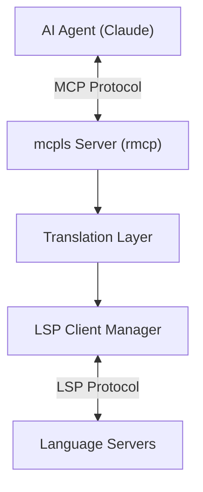

# Changelog

All notable changes to this project will be documented in this file.

The format is based on [Keep a Changelog](https://keepachangelog.com/en/1.1.0/),
and this project adheres to [Semantic Versioning](https://semver.org/spec/v2.0.0.html).

## [Unreleased]

- **Built-in Nix and Linux/macOS Swift language-server profiles** — add marker-gated `nixd` and `sourcekit-lsp` defaults on platforms supported by the Swift toolchain; add Nix to the default extension map so ast-grep fallback recognizes `.nix` files.

## [0.3.9] - 2026-08-05

### Added

- **`workspace.max_documents`/`workspace.max_file_size` TOML config fields** — expose `DocumentTracker`'s previously hardcoded resource limits (100 open documents, 10MB max file size) for configuration, following the existing `heuristics_max_depth` flat-field-on-`[workspace]` pattern. `0` disables either limit, matching `ResourceLimits`'s existing semantics; omitting either field preserves today's defaults unchanged. New `WorkspaceConfig::resource_limits()` maps the two fields onto `bridge::ResourceLimits`, and new `Translator::with_resource_limits` builder wires the resolved limits into `serve()`'s `Translator` construction alongside the existing `with_extensions` builder — the two builders now read each other's already-set field when rebuilding `document_tracker`, so they can be called in either order without one silently discarding the other's effect. `Error::DocumentLimitExceeded`/`FileSizeLimitExceeded` messages gained a static hint pointing at the relevant config field. Documented under "Workspace Section" in `docs/user-guide/configuration.md`. Note: `bridge::ResourceLimits` is now re-exported from `bridge` (previously private to `bridge::state`), which as a side effect makes the already-`pub` `DocumentTracker::new` constructible from outside the crate for the first time — this narrows the rationale given in the `DocumentState` encapsulation entry below (#304), which assumed `ResourceLimits`'s privacy made `DocumentTracker` uninstantiable externally; `DocumentState`'s own field privacy and invariant-enforcing methods are unaffected. (#315)

- **`scripts/install.sh` and `scripts/install.ps1`** — one-command installers for Linux/macOS (`curl -fsSL .../install.sh | sh`) and Windows (`irm .../install.ps1 | iex`). Both detect OS/architecture, resolve the latest (or a pinned `MCPLS_VERSION`/`-Version`) GitHub Release via the `/releases/latest/download/` convention, verify the published SHA256 checksum before extracting, and install `mcpls` to `~/.local/bin` (`$HOME\.local\bin` on Windows) without requiring `sudo`. `install.sh` is POSIX `sh` and shellcheck-clean; a `shellcheck` CI job lints it, gated by a new `detect-changes` `scripts` output (`scripts/**`, `.github/workflows/ci.yml`) so it only runs when those paths change. The `security` (cargo-deny) job is now likewise gated on the existing `run-full-ci` output, so a docs-only or scripts-only change no longer triggers a full dependency/license audit. README's Installation section now documents both scripts as the primary install method, keeps `cargo install mcpls` as an alternative, and fixes the pre-built-binaries table to the real target-triple archive names produced by `release.yml` (the previous table referenced stale/nonexistent names, including a musl build that has never been produced by CI). (#288)

- **`skills/mcpls/` Agent Skill** — a spec-compliant [Agent Skill](https://agentskills.io/specification) (`SKILL.md` + `references/configuration.md`) teaching an AI coding agent to install mcpls, choose CLI flags/`MCPLS_*` environment variables, register mcpls with an MCP client, and write `mcpls.toml`, including the per-platform config-path table, the project-config trust model, and the `--listen`/`transport-http` feature-gate asymmetry. (#252)
- **`ToolAnnotations` (`readOnlyHint`, `destructiveHint`, `idempotentHint`) plus top-level `Tool.title` on all 20 `#[tool]` definitions** in `mcp/server.rs` — MCP clients can now use these hints to decide when to skip confirmation dialogs. All 20 tools are marked `readOnlyHint=true`: mcpls has no write-back path today, so even `rename_symbol`, `format_document`, and `get_code_actions` only return a proposed edit rather than applying one — revisit their classification if a write-back path is added. Superseded by #301 below, which moves these per-tool declarations to a single central pass. (#136)
- **Shared `PositionParams`/`RangeParams` structs** in `mcp/tools.rs`, embedded via `#[serde(flatten)]` in the eleven tool-parameter structs that previously repeated the `file_path`/`line`/`character` trio or the `start_line`/`start_character`/`end_line`/`end_character` quad verbatim. The MCP wire format (flat JSON) and generated JSON schema are unchanged. (#235)
- **`LspServerConfig::request_timeout_seconds`** — per-request LSP timeout, configurable per server and separate from the handshake-only `timeout_seconds`. Defaults to 30s (bit-identical to the previous hardcoded behavior). Bounds a single request attempt, not a whole tool call: on a `-32802` (`ServerCancelled`) response, `LspClient::request` retries up to 4 attempts total, so the worst-case latency for one tool call is `4 * request_timeout_seconds + 3.5s`. `LspClient::request_timeout()`/`completion_timeout()` accessors expose the effective value; `completion_timeout()` clamps to at most 10s regardless of the configured value — an explicit MVP ceiling, not an oversight. See `docs/user-guide/configuration.md#request_timeout_seconds`. (#267)
- **`Error::CapabilityNotSupported`** — new `Error` variant returned when the LSP server routed for a request does not advertise the `ServerCapabilities` field a capability-gated tool needs. (#240)
- **In-band notice when a project-local `mcpls.toml` is ignored as untrusted** — `ServerInfo.instructions` (`McplsServer::get_info`) now appends a note when a CWD-discovered `./mcpls.toml` was skipped because it wasn't trusted, so MCP clients that swallow stderr (where the existing `tracing::warn!` goes) can still see the ignore decision and act on it. New `ServerConfig::project_config_ignored` field (load-time metadata, not TOML-configurable) carries the signal from `ServerConfig::load_with_trust` through to the MCP layer. (#248)
- **`list_resources` pagination** — the resource list handler now returns at most `RESOURCE_PAGE_SIZE` (100) resources per call, using `PaginatedRequestParams.cursor`/`ListResourcesResult.next_cursor` for a client to page through the rest, instead of always returning every open document in one response — previously an unbounded list could exceed transport buffer limits (especially over stdio) on large workspaces. The cursor is an opaque page-start index over the open-document paths sorted deterministically for the call; a malformed cursor is rejected with an error, and a well-formed but stale/out-of-range one (e.g. documents closed between calls) yields an empty final page rather than an error. Note: the cursor indexes position, not document identity — a document closing below the cursor between calls can shift a later entry out of the next page. (#133)
- **Automatic LSP server respawn on crash** — `Translator` now detects when a routed LSP server's child process has exited and transparently respawns and re-initializes it before resolving the next tool call for that server, instead of leaving the session degraded until mcpls itself is restarted. Concurrent callers that observe the same dead server single-flight on a per-server lock so only one respawn happens; any requests still parked on the old connection are failed immediately instead of waiting out their own timeout. A crash-looping server backs off exponentially (1s up to 30s) instead of retrying on every tool call — including the more realistic "starts, initializes, then dies again a moment later" loop, not just an outright spawn failure. New `LspServer::has_exited`, `DocumentTracker::forget_server` (resets per-server document sync state; the commit is checked against a per-server sync generation while still holding the document lock, so an in-flight sync against the old connection can never land after a concurrent respawn clears it), and `Translator::with_notification_cache` (lets the respawn path invalidate the crashed connection's cached diagnostics — triggered only when the crashed server was the diagnostics route for its language, not for a non-route server like a dedicated hover server; note that the clear itself is currently workspace-wide across *all* languages, not scoped to just the crashed one, since the diagnostics cache has no per-language clear yet — a crashed rust-analyzer also clears a healthy pyright's cached entries, though `handle_diagnostics`'s authoritative pull path is unaffected, only the cached-only path degrades until that server republishes). A respawned server's own push notifications are drained and discarded rather than reconnected to the existing notification pump — diagnostics push does not resume for it until the whole mcpls process restarts, a known scope trade-off. New `Error::ServerUnavailable` variant distinguishes "respawn could not proceed" (no config registered, or backing off) from a plain `Error::ServerTerminated`. (#249)

### Changed

- **`rmcp` bumped from 3.0.0 to 3.1.0.** Breaking-for-affected-clients: `transport-http`'s stateless (non-`initialize`) POST handling now unconditionally rejects a `/mcp` request carrying `MCP-Protocol-Version: 2026-07-28` or later that omits `_meta.protocolVersion`/`_meta.clientCapabilities` from the request body, returning `HTTP 400` / JSON-RPC `-32602` where 3.0.0 accepted it; this check is not gated by `rmcp`'s new `stateless_protocol_metadata_required` option, which mcpls does not set (default `false`). Scope: only a hand-rolled or non-`rmcp` HTTP client sending a `2026-07-28`+ protocol header without `_meta` is affected — `rmcp`-based clients at that protocol version already attach `_meta`, `2025-11-25` and earlier protocol headers are unaffected, and `transport-http` is an opt-in, off-by-default feature. (#296)
- **`NotificationCache::get_logs`/`get_messages` renamed to `logs`/`messages`** — drops the redundant `get_` prefix; `get_diagnostics(&self, uri: &str)`, a keyed lookup rather than a plain accessor, is unchanged. BREAKING CHANGE: any caller of `NotificationCache::get_logs`/`get_messages` must switch to `logs`/`messages`. (#293)
- **`DocumentState`'s six fields (`uri`, `language_id`, `version`, `content`, `disk`, `synced`) are now private** — internal encapsulation improvement, not an externally-reachable breaking change: `DocumentTracker::new`'s only parameter, `ResourceLimits`, is not re-exported outside `bridge::state`, so no code outside that module could construct a `DocumentTracker` (and therefore never obtain a `DocumentState`) either before or after this change. Previously the type had no constructor and let any caller writing a struct literal inside `bridge::state` violate its documented invariants (monotonic `version`, `disk` provenance, per-server `synced` tracking) by touching fields directly; those invariants are now enforced by the type itself, via internal methods (`apply_local_edit`, `commit_reload`, `set_disk`, `mark_synced`, `forget_server`) rather than documentation alone. Read access is now via `#[must_use]` getters: `uri()`, `language_id()`, `version()`, `content()`, `synced_version(&ServerId) -> Option<i32>` (there is no public `disk()`, since it would leak the crate-internal `DiskSync` type). (#304)
- Sort `[workspace.dependencies]` in root `Cargo.toml` alphabetically (#232)
- **`bridge::translator`'s fixed `DEFAULT_LSP_TIMEOUT`/`COMPLETIONS_LSP_TIMEOUT` constants (added in #231 below) removed** in favor of the new per-server `request_timeout_seconds` config field (see Added) — all 17 call sites now read `client.request_timeout()`/`client.completion_timeout()`. Breaking change: `LspServerConfig` gained a field, so existing `LspServerConfig { .. }` struct-literal construction (not behind `#[non_exhaustive]`) must add `request_timeout_seconds`. Also breaking: `ServerConfig::validate()` now rejects `timeout_seconds == 0` in addition to the new `request_timeout_seconds == 0` check — no working config could previously set `timeout_seconds` to 0 (it made `initialize` fail instantly), so no functioning setup is affected. (#267)
- **Shared `DEFAULT_LSP_TIMEOUT` constant** — the 16 handler methods in `bridge::translator` that each duplicated `Duration::from_secs(30)` now share one module-level constant; `get_completions`'s intentionally shorter timeout is now the named `COMPLETIONS_LSP_TIMEOUT` constant. No behavior change. Superseded by #267 above, which replaces both constants with the configurable `request_timeout_seconds`. (#231)
- **`read_resource` response shape distinguishes untracked from tracked-but-clean diagnostics** — Breaking change: the response, previously `null | {"uri": ..., "version": ..., "diagnostics": [...]}` (a direct serialization of the internal cache entry), is now always an object: `{"tracked": bool, "version": number | null, "diagnostics": [...]}`. `tracked` lets a client tell "mcpls has no information about this file" (`tracked: false`, always paired with `diagnostics: []`) apart from "mcpls has information about this file, whether clean or not yet analyzed" (`tracked: true, diagnostics: []`) — previously both serialized as `null` and were indistinguishable. `tracked` is `true` when the file is currently open (`Translator::is_document_open`) *or* the diagnostics cache already holds an entry for it — not open-state alone, since an LSP server can publish diagnostics for a file mcpls never explicitly opened (e.g. one rust-analyzer analyzes transitively), and the response must never claim `tracked: false` while still returning that file's real diagnostics. `version` (the document version diagnostics were computed against — the client's staleness signal) is carried over unchanged; `uri` is dropped, since the caller already supplied it in the request. (#132)
- Regression test pinning RFC 3986 §2.2 percent-encoding of `[`, `]`, `^`, `|`, `{`, `}`, and backtick in the `try_path_to_uri`/`encode_rfc3986_path_chars` `file://` URI conversion; confirms the `url` crate already encodes `{`, `}`, and backtick, so no code change was needed for those three. Scope: covers `file://` URI conversion only — `bridge::resources`'s separate `lsp-diagnostics://` URI construction does not call `encode_rfc3986_path_chars` and is not covered here. (#168)
- Unit tests for `LspClient::should_retrigger` and its wiring into the `ServerCancelled` (-32802) retry loop: full retry exhaustion returns the original error, `retriggerRequest: false` returns immediately without retrying, and a cancelled-then-successful retry resolves normally. (#161)
- **`HttpConfig` gains request body and session limits** — Breaking change: HTTP transport now caps POST request body size (`413 Payload Too Large` on overflow, wired into `rmcp`'s built-in body-size enforcement) and concurrent HTTP sessions. The session cap is a hard bound enforced atomically at session creation by a semaphore-backed `SessionManager` wrapper (not inferred from request headers, which cannot reliably distinguish session-creating requests across `rmcp`'s legacy and stateless protocol paths); requests rejected once the cap is reached receive `429 Too Many Requests` with a `Retry-After` header. `HttpConfig` gains a `new(bind, path)` constructor plus `with_max_request_body_bytes`/`with_max_concurrent_sessions` builders and is now `#[non_exhaustive]`; existing `HttpConfig { .. }` struct-literal construction must switch to `HttpConfig::new(..)`. (#243)
- **`config::ToolRouter::resolve_any` signature** — Breaking change: now returns `Result<&ServerId, config::NoServerReason>` instead of `Option<&ServerId>`, and no longer falls back to an arbitrary "first server at all" when neither an explicit claimer nor a catch-all exists for the requested tool — doing so could silently forward a tool to a server whose `handles` list had explicitly declined it. New `config::NoServerReason` enum (`NothingRegistered` / `NoClaimant`) reports why. (#242)
- **`Error` API** — New variants `Error::NoServerForWorkspaceTool { tool }` and `Error::WorkspaceServersInitializing`, the language-less counterparts of `NoServerForTool`/`ServerInitializing` used by workspace-wide tools. `Error` remains `#[non_exhaustive]`. (#242)
- **`bridge::state::path_to_uri` signature** — Breaking change: now returns `Result<Uri, Error>` instead of panicking on failure. (#234)
- **Spawned LSP servers no longer inherit mcpls's full environment** — Breaking change: previously `LspServer::spawn` called `tokio::process::Command::new` with no `.env_clear()`/`.env()`/`.envs()`, so every LSP server process (and every tool *it* invokes, e.g. rust-analyzer's `cargo`/`rustc`/`build.rs` children) inherited the entire parent environment by default; separately, the `env` field on `[[lsp_servers]]` config entries was parsed but never applied (dead code). `spawn` now clears the child's environment and passes through only a minimal allowlist — `PATH`, `HOME`, `USERPROFILE`, `TMPDIR`/`TEMP`/`TMP` on every platform, plus `SystemRoot`, `SystemDrive`, `windir`, `APPDATA`, `LOCALAPPDATA`, `ProgramData`, `ProgramFiles`, `COMSPEC`, `PATHEXT`, `NUMBER_OF_PROCESSORS`, `USERNAME` on Windows — for variables actually present in the parent process, then applies `[lsp_servers.env]` on top so configured entries can override the passthrough. If your server relies on an inherited variable outside this allowlist (proxy settings, `SSH_AUTH_SOCK`, toolchain env like `DATABASE_URL`/`LIBCLANG_PATH` read by a `build.rs`, custom `PATH` entries, etc.), add it explicitly under that server's `[lsp_servers.env]` in `mcpls.toml` — see `docs/user-guide/configuration.md#env`. This closes a real information-disclosure risk: any secret or token present in mcpls's own environment was previously leaked to every third-party LSP binary, whether or not it had a legitimate need for it. (#236, #246, #247)
- **Capability-gated tool dispatch** — every tool with a corresponding optional `ServerCapabilities` field now checks it before dispatching: `get_hover` (`hoverProvider`), `get_definition` (`definitionProvider`), `get_references` (`referencesProvider`), `rename_symbol` (`renameProvider`), `get_completions` (`completionProvider`), `get_document_symbols` (`documentSymbolProvider`), `format_document` (`documentFormattingProvider`), `workspace_symbol_search` (`workspaceSymbolProvider`), `get_code_actions` (`codeActionProvider`), `prepare_call_hierarchy`/`get_incoming_calls`/`get_outgoing_calls` (`callHierarchyProvider`), `get_signature_help` (`signatureHelpProvider`), `go_to_implementation` (`implementationProvider`), `go_to_type_definition` (`typeDefinitionProvider`), and `get_inlay_hints` (`inlayHintProvider`) — returning `Error::CapabilityNotSupported` instead of sending a request the server never claimed to support. `get_diagnostics` is deliberately left ungated, since it already falls back to the push-notification cache on error. For the six handlers that open a document, the check now runs before `textDocument/didOpen` is sent, so a rejected server never observes the open notification. The check is based solely on the `ServerCapabilities` snapshot taken during `initialize` — a server that only advertises a capability later via dynamic `client/registerCapability` will still be rejected as unsupported. (#240)
- **`mcp::server` tool handlers deduplicated** — the repeated `Result<T> -> Result<String, McpError>` mapping in every `#[tool]` handler is now a single shared `to_tool_result` helper; no behavior change. (#230)
- **`McplsServer::new` / `BridgeContext::new` signatures** — Breaking change: both now take an additional `project_config_ignored: bool` parameter, used to surface the untrusted-project-config notice above. `ServerConfig` (not `#[non_exhaustive]`) also gains the `project_config_ignored` field, breaking any downstream struct-literal construction. Acceptable pre-1.0. (#248)
- **Duplicate `ServerId` startup error now names the conflicting `[[lsp_servers]]` entries by `command`/`args`** instead of repeating the shared `ServerId` string for both halves, which previously gave no way to tell two conflicting entries apart. Deliberately does not print a positional index — `ToolRouter::from_configs` only sees the post-heuristics subset applicable to a given workspace, not the raw `[[lsp_servers]]` array, so an index would usually name the wrong TOML entry. (#237)
- **`NotificationCache::store_diagnostics` signature** — Breaking change: now takes a `&ServerId` as its first parameter, so diagnostics are tracked per owning server (see the per-server cache fairness fix below). (#266)
- **`serve`/`serve_with` now validate caller-supplied `ServerConfig`s** — Breaking change: previously `ServerConfig::validate()` only ran on the TOML-loading path (`load`/`load_from`), so a `ServerConfig` built programmatically by a library embedder skipped validation entirely and only surfaced misconfiguration later as silent accessor-level clamping (e.g. `LspClient::request_timeout()`). `serve_with` (and `serve`, which delegates to it) now call `validate()` unconditionally, so an invalid caller-supplied config (empty `command`/`language_id`, zero `timeout_seconds`/`request_timeout_seconds`, empty or duplicate-tool `handles`) is rejected up front with the same `Error::InvalidConfig` the TOML path already returns. A config that was previously accepted silently by `serve`/`serve_with` despite failing these checks will now return an error instead. (#282)
- **`ServerInitConfig` gains a `position_encodings` field** — carries the configured position-encoding preference order into `LspServer::spawn`'s `initialize` handshake (see Fixed below). Breaking change: existing `ServerInitConfig { .. }` struct-literal construction (not behind `#[non_exhaustive]`) must add `position_encodings`. Also breaking: `ServerConfig::validate()` now rejects an empty `workspace.position_encodings` list or any value other than `"utf-8"`/`"utf-16"`/`"utf-32"` — a config that previously left this garbage had it silently ignored; it now fails to load. (#287)
- **`bridge::translator` position-conversion helpers are now `async`** — Breaking change: `EncodingCtx`'s `to_lsp`/`to_mcp`/`normalize_range`/`denormalize_range`, roughly twenty `Translator` handler/helper methods that call them, and `diagnostics_from_cache_entry`/`merge_diagnostics` all gained `async`, needed to `.await` the disk-read fallback used by the negotiated-encoding fix below. No MCP tool's external request/response shape changed. Acceptable pre-1.0. (#290)
- **`mcp::server`'s per-tool `annotations(...)` blocks replaced by a single central pass** — the identical `read_only_hint = true, destructive_hint = false, idempotent_hint = true` triple, previously repeated on all 20 `#[tool(...)]` attributes, is now applied once by `McplsServer::tool_router()`, which retags the impl block `#[tool_router(router = declared_tool_router)]` and fills in any route missing `annotations` via `ToolAnnotations::from_raw`. A tool that declares its own `annotations(...)` keeps them. No client-visible change: the resulting `Tool` values are byte-identical to the previous per-tool declarations (pinned by a new golden-snapshot test, `tool_surface.json`). Also collapsed the redundant `let result = { ... }; to_tool_result(result)` two-statement pattern in 19 of the 20 handlers down to a single `to_tool_result(...)` expression; `get_cached_diagnostics` keeps its `let` binding since its body is a multi-arm `match`, not a single expression. (#301)
- **`mcp::tools`'s six position-only parameter wrappers collapsed into `PositionParams`** — `HoverParams`, `DefinitionParams`, `SignatureHelpParams`, `GoToImplementationParams`, `GoToTypeDefinitionParams`, and `CallHierarchyPrepareParams` each wrapped `PositionParams` with `#[serde(flatten)]` and added nothing: `rmcp`'s schema validation already strips the top-level `title`/`description` these wrappers carried before it reaches an MCP client, so the six were structurally identical to `PositionParams` itself. The six corresponding `#[tool]` handlers (`get_hover`, `get_definition`, `get_signature_help`, `go_to_implementation`, `go_to_type_definition`, `prepare_call_hierarchy`) now take `Parameters<PositionParams>` directly. No client-visible schema or wire-format change. (#302)
- **`bridge::translator.rs` split into `bridge/translator/` submodules** — the single 7100+ line file (setup/lifecycle, all 20 tool handlers, DTOs, and their tests) is now `mod.rs` (the `Translator` struct and setup/lifecycle methods) plus twelve sibling modules grouped by domain (`clock`, `respawn`, `routing`, `dto`, `encoding_ctx`, `navigation`, `diagnostics`, `edits`, `symbols`, `assist`, `call_hierarchy`, and a shared `testing` fixture module), matching the existing per-file test convention used by `bridge::state`/`bridge::notifications`/`bridge::encoding`. Pure code motion — `bridge::translator`'s public re-export surface (`bridge/mod.rs`'s `pub use translator::{...}` block) and every `Translator` method signature are unchanged. (#300)
- **Respawn-backoff bookkeeping now goes through an injectable `Clock`** — `Translator::respawn_if_dead` and its backoff helpers (previously hardcoded to `std::time::Instant::now()`) now read time through a new `bridge::translator::clock::Clock` trait, defaulted to `SystemClock` in production. No production behavior change; this is a test-only seam (`Translator::with_clock`, `#[cfg(test)]`) that lets backoff-window tests advance a `FakeClock` deterministically instead of relying on real sleeps or incidental timing. Also switches the two call sites that used `Instant::elapsed`/`duration_since` directly to `saturating_duration_since`, for explicitness at the injection seam now that the clock reading is no longer guaranteed to be `SystemClock`; behavior is unchanged (`elapsed`/`duration_since` and `saturating_duration_since` are equivalent on current Rust). (#292)
- **`config::server`'s builtin `LspServerConfig` constructors deduplicated** — extracted a private `builtin()` helper for the six fields (`env`, `initialization_options`, `timeout_seconds`, `request_timeout_seconds`, `name`, `handles`) previously repeated verbatim across all six built-in language constructors (`rust_analyzer`, `pyright`, `typescript`, `gopls`, `clangd`, `zls`); only the per-language values remain at each call site. No behavior change. (#316)
- Bump rmcp from 2.2.0 to 3.0.0
- Bump toml from 1.1.3+spec-1.1.0 to 1.1.4+spec-1.1.0
- CI: bump actions/checkout from 7.0.0 to 7.0.1
- CI: bump actions/labeler from 6 to 7
- CI: bump cargo-bins/cargo-binstall from 1.21.0 to 1.21.1
- CI: bump lewagon/wait-on-check-action from 1.8.1 to 1.9.0

### Removed

- **`mcpls_core::mcp::{HoverParams, DefinitionParams, CallHierarchyPrepareParams}`** — Breaking change: removed along with the other three position-only wrapper structs described above (`SignatureHelpParams`, `GoToImplementationParams`, `GoToTypeDefinitionParams` were never re-exported from `mcp::mod`). Use `mcpls_core::mcp::PositionParams` directly. No deprecation shim, per pre-1.0 policy. (#302)

### Security

- **Explicit size caps added on config-file reads, cached LSP notification data, MCP tool string params, and LSP error messages forwarded to callers** — several inputs were previously bounded only by an outer transport/protocol limit (or not bounded at all), each a defense-in-depth gap found during a security audit:
  - `ServerConfig::load_from` now reads the config file through a bounded `Read::take(MAX_CONFIG_FILE_BYTES + 1)` and rejects it with `Error::FileSizeLimitExceeded` (8 MiB cap) if that limit is exceeded, instead of calling `std::fs::read_to_string` with no upper bound. A bounded read, not a `std::fs::metadata` size pre-check, is required: `metadata().len()` reports `0` for character devices, FIFOs, and many procfs entries regardless of how much data they can actually produce (e.g. `/dev/zero`), so a pre-check alone can be bypassed by a path pointing at one. (#309)
  - `rename_symbol`'s `new_name` MCP parameter is now capped at 1000 bytes and `get_completions`'s `trigger` at 8 bytes (`Error::InvalidToolParams` on overflow), matching the existing cap already in place on `workspace_symbol_search`'s `query`. (#309)
  - `NotificationCache::store_log`/`store_message` now truncate each cached message to 256 KiB via a new shared `truncate_string` helper (`crate::util`), and `store_diagnostics` truncates each diagnostic's `message` field the same way, then additionally bounds the *whole* diagnostics list to 1 MiB of serialized JSON via `cap_diagnostics_entry_size` — a per-message cap alone does not bound a `Vec<LspDiagnostic>`'s length or its several other free-form/arbitrary-JSON fields (`source`, `code`, `code_description`, `related_information`, `data`, `tags`), so a hostile server could still publish e.g. 100k small diagnostics, or one diagnostic with a multi-MiB `data` blob or `source` string, without ever exceeding the per-message cap. `cap_diagnostics_entry_size` guarantees this bound with a final, unconditional check rather than assuming its field-specific mitigations (severity-preferential truncation to the largest fitting prefix via binary search for many diagnostics — not a lossy, severity-blind flat halve; dropping opaque fields and truncating `source`/`code` for one still-oversized diagnostic) cover every case, logs a `tracing::warn!` whenever it drops a diagnostic or a `data`/`code_description`/`related_information` field (the latter can silently break a later `textDocument/codeAction` request's quick fix, per the LSP spec's `data` round-trip contract) so the degradation is visible rather than silent, and skips the full JSON-serialization pass it would otherwise need on every `publishDiagnostics` (a hot path) via a conservative cheap size estimate whenever no diagnostic carries `data`/`code_description`/`related_information`/`tags` — that estimate multiplies each string field's raw byte length by a worst-case JSON-escaping factor of 6 (a control character like NUL costs 6 bytes as `\u00XX` once encoded) rather than summing raw lengths directly, since the latter could undercount an escape-heavy message enough to let an oversized entry skip the real check entirely. The existing `MAX_LOG_ENTRIES`/`MAX_SERVER_MESSAGES`/`MAX_DIAGNOSTIC_ENTRIES` caps bound entry *count* only, not the byte size of any single entry. (#311)
  - `LspClient`'s handling of a JSON-RPC error response from a spawned LSP server now truncates the message forwarded to the MCP caller in `Error::LspServerError` to 4 KiB, instead of sending the full unbounded `error.message` — previously only the separate, much shorter (200-byte) log-line truncation existed, and the caller-facing message was unbounded. (#313)

### Fixed

- **`run_stdio` registered its `SIGTERM`/`SIGINT` handler too late to catch a signal sent early in startup** — `serve_with` previously ran config validation, workspace-root heuristics, and `spawn_lsp_servers_background` (which spawns LSP child processes concurrently) before `run_stdio` ever registered a signal handler, and `run_stdio` itself only did so *after* `mcp_server.serve(..)`'s MCP `initialize` handshake resolved — `rmcp`'s `serve(..)` awaits the client's first message internally, so a signal arriving at any point up to and including that wait fell through to the OS's default disposition (immediate termination, skipping `Translator::shutdown_servers` and risking an orphaned LSP child process mid-spawn; the exact failure mode #270 was filed to prevent). New `ShutdownSignal` type is now constructed once, as the first statement in `serve_with`, before any of that startup work, and moved by value into whichever transport runs; `run_stdio` races it against the handshake itself, then reuses the same instance in its existing post-handshake `select!`. Also fixed a related gap introduced while designing the reused handle: `SIGINT` was previously re-registered via `tokio::signal::ctrl_c()` on every wait (a fresh one-shot listener each time), which silently lost a signal delivered while a different `select!` branch was being polled — `ShutdownSignal` now holds a persistent listener per signal kind (`SIGTERM` and `SIGINT` on Unix via `tokio::signal::unix::signal`, `Ctrl-C` on Windows via the persistent `tokio::signal::windows::ctrl_c()` stream) for its entire lifetime instead. (#318)
- **`MCPLS_LOG_JSON`/`MCPLS_TRUST_PROJECT_CONFIG` rejected common boolean env-var spellings** — both flags are declared as plain `bool` fields with clap's `env` attribute, whose derived value parser is `str::parse::<bool>()`, accepting only the exact lowercase literals `"true"`/`"false"`. Any other common convention (`1`/`0`, `yes`/`no`, `Y`/`N`, `on`/`off`, uppercase `TRUE`/`FALSE`) caused clap to print a parse error and exit nonzero before `logging::init` or anything else ran — no LSP servers spawned, no MCP server started, nothing logged. A new `parse_bool_flag` value parser, applied to both fields via `#[arg(value_parser = ...)]`, now accepts `1`/`0`, `true`/`false`, `yes`/`no`, `y`/`n`, and `on`/`off`, case-insensitively; the `--log-json`/`--trust-project-config` CLI flags themselves are unaffected (still bare, no-value flags). Any other value is still a clear parse error at startup. (#295)
- **mcpls did not exit on `SIGTERM`/`SIGINT` while a stdio MCP client kept its stdin write end open** — `rmcp::transport::stdio()` is backed by `tokio::io::stdin()`, which internally parks an uncancellable `spawn_blocking` thread in a raw `read()` syscall; `#[tokio::main]`'s generated wrapper blocks in `Runtime::drop` waiting for that thread once `main`'s body returns, even though all real shutdown work (LSP server teardown, log flush) had already completed by then. `main` now calls `std::process::exit` as its final step instead of returning normally, terminating immediately once `run().await` resolves and bypassing the blocking-pool wait. `main`'s signature changed from `-> std::process::ExitCode` (added in #279) to `()`; not a breaking change for library embedders — a binary's `main` signature is not part of `mcpls-core`'s public API, and the resulting exit codes (0/1) are unchanged. Scoped to `crates/mcpls-cli/src/main.rs` only — `mcpls-core`'s `serve`/`serve_with`/`shutdown`/`run_stdio` are unaffected and keep normal `Result`-returning semantics for library embedders; their doc comments now carry a "Shutdown" note (and updated examples) warning embedders of the same `process::exit` requirement under the stdio transport. Also fixed: `await_lsp_init_handle`'s timeout branch called `JoinHandle::abort()` without a subsequent await, so on a `SIGTERM` arriving mid-`spawn_batch` (before any server registers), `process::exit` could now run before the runtime dropped the aborted task's locals — including not-yet-registered LSP `Child` handles relying on `kill_on_drop` — orphaning those processes (the failure mode #270 guards against). `abort()` is now followed by a bounded (1s) re-await of the same handle so that drop happens before `main` exits. (#308)
- **`workspace.position_encodings` was parsed but never consumed** — the configured preference order was previously dead: `LspServer::spawn`'s `initialize` handshake always offered a hardcoded `["utf-8", "utf-16"]` regardless of what `mcpls.toml` set. It is now sent as `capabilities.general.positionEncodings` in the configured order (see the accompanying breaking changes under Changed above). Note this only changes which encodings mcpls *offers*; the encoding a server actually negotiates is still not consumed downstream of the handshake (tracked separately in #290). (#287)
- **`LspServer::position_encoding()` was computed but never consumed** — the encoding actually negotiated with an LSP server during `initialize` was recorded but every MCP↔LSP position conversion in `bridge::encoding`/`bridge::translator` still assumed a fixed encoding regardless of it. This was not a rare edge case: under mcpls's own `capabilities.general.positionEncodings` offer order (see #287 above), UTF-8 is empirically the *default* negotiated encoding for both rust-analyzer and clangd, so any non-ASCII line on either server could silently produce wrong columns. Position conversions now resolve the real negotiated encoding per LSP server via a new `EncodingCtx` and derive UTF-8/UTF-16/UTF-32 column offsets from the actual line text — preferentially from `DocumentTracker`'s in-memory state for a tracked document (the exact content mcpls has sent that server via `didOpen`/`didChange`), falling back to an async disk read for a referenced-but-untracked file (e.g. a cross-file `references`/`rename` result). Line-text lookups guard against splitting a multi-byte UTF-8 character, which previously could panic; a malformed or out-of-range character offset now falls back to the original, unconverted value with a `tracing::warn!` instead of panicking or erroring. (#290)
- **`--log-json`/`MCPLS_LOG_JSON` was parsed but never consumed** — the flag was defined in `Args` and the `json` feature of `tracing-subscriber` was already enabled, but `logging::init` always built the compact human-readable `fmt` layer regardless of its value. `logging::init` now takes the flag and selects the JSON `fmt` layer when set. Also fixed: on a fatal startup/runtime error, `main` previously returned `Result<()>` and let Rust's default `Termination` impl print the error via `Debug` directly to stderr, bypassing the tracing subscriber (and `--log-json`) entirely; `main` now returns `std::process::ExitCode` and logs fatal errors through `tracing::error!` before exiting, so crash output is JSON too when `--log-json` is set. (#279)
- **macOS default config path documented incorrectly** — the rustdoc comment on `ServerConfig::load_from`, `README.md`, `crates/mcpls-cli/README.md`, `docs/user-guide/configuration.md`, `docs/user-guide/getting-started.md`, `docs/user-guide/installation.md`, `docs/user-guide/troubleshooting.md`, the `--config` flag's `--help` text, and `skills/mcpls/SKILL.md` all stated or implied that mcpls reads `~/.config/mcpls/mcpls.toml` on macOS (the Linux XDG path); mcpls actually resolves the platform config directory via `dirs::config_dir()`, which on macOS is `~/Library/Application Support/mcpls/mcpls.toml` — the Linux path is never read there. Following the old docs verbatim would have a user or agent write a config mcpls silently never loads. (#280)
- **stdio transport now handles SIGINT/SIGTERM and shuts down spawned LSP servers gracefully** — `run_stdio`, the default transport used by every stdio-based MCP client, previously installed no signal handler at all, so an uncaught SIGINT/SIGTERM bypassed `kill_on_drop` and orphaned every spawned LSP child process; `run_http` already handled signals but, like the clean stdin-EOF exit path, never invoked the LSP-level graceful `shutdown`/`exit` handshake (`LspServer::shutdown()` was previously dead code outside tests). Both transports now share signal-handling logic, and `serve_with` calls a new `Translator::shutdown_servers()` after the transport future resolves — regardless of whether that was a signal, stdin EOF, or HTTP's own shutdown — which drains and gracefully shuts down every registered `LspServer` concurrently, with a bounded per-server grace period before falling back to `kill_on_drop`. `run_http`'s graceful shutdown wait is now itself bounded so a stuck connection can't block LSP cleanup indefinitely. Known limitation: this does not cover process termination via an uncaught panic under `panic = "abort"` (`[profile.release]`), since no `Drop` runs on that path — a real fix needs process-group isolation, which is out of scope here. (#241)
- **Background LSP init task's `JoinHandle` is no longer dropped on shutdown** — `spawn_lsp_servers_background` (spawned by `serve_with` so slow-initializing servers, e.g. `OmniSharp` on a large Unity solution, don't block the MCP handshake) discarded the `tokio::spawn` `JoinHandle`, so a panic inside `LspServer::spawn_batch`, `register_servers`, or a diagnostics pump task was silently swallowed — the server kept running with tools stuck returning `ServerInitializing` forever, with no log line or error surfaced. `spawn_lsp_servers_background` now returns the `JoinHandle`, and the new `shutdown`-internal `await_lsp_init_handle` helper awaits it (after `Translator::shutdown_servers`) with a bounded 5s timeout: a panic is now logged at `error` level, and a timeout logs a warning and calls `JoinHandle::abort()` so the task is actually stopped rather than merely detached and left running. (#196)
- **HTTP transport startup warning gave inverted authentication guidance** — the non-loopback bind warning previously read "...ensure no authentication is required", which could be misread as instructing operators to confirm auth is *not* needed. mcpls performs no authentication on any transport; the message now tells operators to put such deployments behind a reverse proxy that enforces authentication. (#233)
- **`config::mod` CWD-mutating tests could leave the process working directory changed after a mid-test panic** — added a `CwdGuard` RAII helper that restores the original directory on drop, not only on the successful path, alongside the existing mutex serialization against concurrent CWD use. (#238)
- **`LspClient::request` leaked its `pending_requests` entry on timeout** — a timed-out request never removed its slot from the shared pending-requests map, so a server that stalled (without fully crashing) would accumulate one leaked entry per timed-out call for the life of the connection. `LspClient` also gained `fail_pending_requests`, used by the respawn path above to fail stragglers immediately rather than leaving each to time out on its own. (#239)
- **`workspace_symbol_search` now fails with a specific error instead of silently guessing a server when nothing claims it** — previously, when no server explicitly listed `workspace_symbols` in its `handles` and no catch-all existed, the request was silently forwarded to an arbitrary configured server anyway (one that had explicitly declined the tool via `handles`), or — if truly nothing was registered — reported the generic `Error::NoServerConfigured`, indistinguishable from a workspace with no LSP server at all. It now returns a precise error in each case: `Error::NoServerForWorkspaceTool { tool }` when a server is running but none claims the tool (fix: add `workspace_symbols` to a server's `handles`, or configure a catch-all), `Error::WorkspaceServersInitializing` when a relevant server is still spawning, or `Error::NoServerConfigured` only when genuinely nothing is registered and nothing is expected to register. (#242)
- **Removed the last panic-on-untrusted-input paths in URI construction** — `bridge::state::path_to_uri` (and `Translator::cached_diagnostics_uri`, `McplsServer::read_resource`/`subscribe`, which call it) previously `.expect()`-panicked if a canonicalized path could not be converted to a `file://` URI; it now returns `Result<Uri, Error>` and every caller propagates the error instead. Defense-in-depth given the workspace's `panic = "abort"` release profile. (#234)
- **Bounded and scoped the diagnostics notification cache** — `NotificationCache::diagnostics` (keyed by document URI) had no entry cap, unlike the already-bounded `logs`/`messages` queues in the same struct, so a spawned LSP server publishing diagnostics for an unbounded number of distinct (including fabricated, non-existent) URIs could grow it without limit. It is now capped at `MAX_DIAGNOSTIC_ENTRIES` (1000) with least-recently-written eviction — a URI re-published on update (e.g. a file being actively edited) moves to the back of the eviction queue (most-recently-written) instead of staying at its original insertion order and being evicted ahead of untouched files. Diagnostics for URIs outside the configured workspace roots are dropped before caching, so a misbehaving server can no longer flush every legitimate entry out with fabricated out-of-workspace URIs; the workspace-root check itself rejects any path containing `.`/`..` components before comparing, since a lexical `starts_with` prefix check alone would accept a crafted `/workspace/../etc/passwd`-style URI as "inside" the workspace root string. (#234)
- **Windows: workspace-root canonicalization silently dropped every diagnostic** — `canonicalize_workspace_roots` used `Path::canonicalize`, which on Windows returns the `\\?\`-prefixed verbatim path form (e.g. `\\?\C:\Users\...`). A URI-derived path from `Url::to_file_path` is never verbatim-prefixed, so the `starts_with` prefix check in `diagnostic_path_in_workspace` could never match on Windows, causing every diagnostic to be treated as out-of-workspace and dropped. Switched to `dunce::canonicalize`, which resolves symlinks identically but returns the ordinary (non-verbatim) path form. New `dunce` dependency (MIT, no transitive dependencies). (#234)
- **`bridge::resources::make_uri` left RFC 3986 §2.2 "other reserved" characters (`[`, `]`, `^`, `|`) unencoded in `lsp-diagnostics://` resource URIs** — paths containing those characters (e.g. Next.js-style dynamic route segments like `[id]` or `[...slug]`) produced non-conformant URIs, unlike `file://` document URIs from `bridge::state::try_path_to_uri`, which already encoded them. `make_uri` now shares `state`'s `encode_rfc3986_path_chars` helper so both URI schemes get identical encoding. (#265)
- **`MAX_DIAGNOSTIC_ENTRIES` was one budget shared across every registered LSP server** — a noisy server publishing diagnostics for many distinct URIs could evict a quiet server's entries even though the quiet server never came close to a reasonable share of the budget. Diagnostics are now tracked per owning server, each with its own static, equal share of the global budget (`MAX_DIAGNOSTIC_ENTRIES` divided evenly by the number of registered diagnostics-route servers, e.g. 1000 → 250 per server in a 4-server workspace), so a noisy server can only evict its own least-recently-written entries once its share is exhausted, never another server's. This is a tradeoff, not a pure capacity win: a single dominant server's effective cache capacity shrinks as more (even idle) diagnostics-route servers register, trading some of that server's headroom for cross-server fairness — the aggregate cache size across all servers no longer grows unbounded with the server count, which the previous shared-budget design did not guarantee either way (it just let one server consume the whole thing). A crashed server's respawn-triggered cache invalidation is likewise now scoped to just that server's own entries via the new `NotificationCache::clear_server_diagnostics`, instead of clearing every server's cache. (#266)
- **Per-server diagnostics cache eviction was a static equal split, not work-conserving** — each server's share was a fixed `MAX_DIAGNOSTIC_ENTRIES / diagnostics_route_count`, so a dominant server (e.g. rust-analyzer in a 4-language workspace) was capped at a quarter of the budget even while the other three registered servers sat idle and used almost none of their own share. `NotificationCache::store_diagnostics` now only evicts once the *aggregate* entry count across every server reaches `MAX_DIAGNOSTIC_ENTRIES`, and then evicts the least-recently-written entry of whichever server holds the most entries relative to its fair share (falling back to the writer's own oldest entry when every server is within its share). A single active server can now use the full aggregate budget while other registered servers are idle, while the #266 guarantee still holds: a noisy server can only ever evict its own entries once the aggregate is full, never a quiet server's that is still within its fair share. This means a dominant server's cached diagnostics can now grow up to 4x larger than its old static 250-entry share (up to the full 1000-entry aggregate cap in the 4-server example above) when other registered servers stay idle — worst-case memory for the cache rises proportionally, since entries have no per-diagnostic size bound. This matches pre-#266 behavior (a single server could already claim the whole shared budget) rather than introducing a new regression. (#276)
- **`LspServerConfig::request_timeout_seconds` and `timeout_seconds` had no upper bound** — a misconfigured or accidentally-typo'd value (e.g. an extra digit) was passed straight into `Duration::from_secs` in `LspClient::request_timeout()` (per-request) and the `initialize` handshake in `lsp::lifecycle` (`timeout_seconds`); tokio's `timeout`/`sleep` fall back to `Instant::far_future()` (~30 years) for astronomically large durations instead of panicking, so the practical effect was an effectively infinite hang against a stalled or slow-to-start LSP server instead of a diagnosable timeout error. `ServerConfig::validate()` now rejects either field above the new `config::MAX_TIMEOUT_SECONDS` (900, i.e. 15 minutes per attempt — `LspClient::request`'s retry loop means the worst-case latency for one tool call, `4 * request_timeout() + 3.5s`, stays within about an hour) with a clear `Error::InvalidConfig`; `LspClient::request_timeout()` and the `initialize` handshake timeout now also clamp to the same ceiling as a last line of defense for caller-built configs that bypass `validate()`. `ServerConfig::validate()` is now `pub`, so a caller building a `ServerConfig` programmatically (not via TOML) can opt into these checks instead of only getting the silent accessor-level clamp; `serve`/`serve_with` do not call it automatically for a caller-supplied config — that remains a known gap, tracked separately. (#273)
- **`LspClient::message_loop_inner` could panic on a non-ASCII LSP error message** — the error-response log line truncated `error.message` (attacker-influenceable: echoed back by the spawned LSP server) with a raw `&message[..200]` byte-index slice, which panics with "byte index 200 is not a char boundary" if byte offset 200 falls inside a multi-byte UTF-8 character; under the workspace's `panic = "abort"` release profile this aborted the whole mcpls process, dropping every LSP session and in-flight MCP tool call rather than just the one failing request. New `LspClient::truncate_error_message_for_log` cuts on the last UTF-8 char boundary at or before `MAX_ERROR_MESSAGE_LOG_BYTES` (200) instead. Only the logged message was affected; `Error::LspServerError` returned to the caller already carried the full untruncated message. (#294)

## [0.3.8] - 2026-07-27

### Added

- **`--trust-project-config` flag / `MCPLS_TRUST_PROJECT_CONFIG` env var** — opt-in gate for loading a `./mcpls.toml` discovered relative to the current directory. New `config::ProjectConfigTrust` enum and `ServerConfig::load_with_trust(trust)`, which `ServerConfig::load()` now delegates to with `ProjectConfigTrust::Untrusted`. (#229)
- **Explicit per-tool routing** — `[[lsp_servers]]` entries gain optional `name` (routing identity, defaults to `language_id`) and `handles` (list of tools this server serves; omitted means catch-all) fields, so two servers can share one `language_id` and each own a distinct subset of MCP tools (e.g. pyright for everything, pylsp for `diagnostics` only). See `docs/user-guide/configuration.md` for the full semantics, including what happens when the routed server fails to spawn. (#174)
- **`config::ToolKind` / `config::ServerId` / `config::ToolRouter`** — new public types: `ToolKind` is the typed enum of every routable MCP tool; `ServerId` is a server's routing identity; `ToolRouter` resolves `(language, tool)` to a `ServerId`, enforces the workspace-scoped routing rules at startup, and rebinds dead routes to a live catch-all (never to a server that explicitly declined the tool) once server registration completes. (#174)
- **Single source of truth for React language-ID variants** — new `config::react_variant_language_id` / `config::base_language_id`, consumed by both `language_id_for_pattern_extension` and the translator's per-file server routing, replacing two independent hardcoded match arms. (#165)
- **`Translator::merge_diagnostics`** — new public function that merges a pull-model (`textDocument/diagnostic`) `DiagnosticsResult` with a cached push-model `DiagnosticInfo` entry, deduplicating cross-model representations of the same diagnostic; used internally by `handle_diagnostics` (see `### Fixed` below). `Position2D`, `Range`, `DiagnosticSeverity`, and `Diagnostic` gained `PartialEq, Eq` derives to support it. (#244)

### Changed

- **`Error` API** — Breaking change: `Error::ServerInitializing` becomes a struct variant carrying `server_id: config::ServerId` (was a `String` language id). New variant `Error::NoServerForTool { language_id, tool }` returned when a language has a configured server but no server claims the requested tool. `ServerSpawnFailure` gains a `server_id: ServerId` field. `Error` remains `#[non_exhaustive]`; downstream exhaustive matches must include a wildcard arm. (#174)
- **`Translator` API** — Breaking change: `lsp_clients`/`lsp_servers` are now keyed by `ServerId` instead of a raw language string; `register_client`/`register_server` take `impl Into<ServerId>`; `set_expected_languages`/`clear_expected_languages` renamed to `set_expected_servers`/`clear_expected_servers` and take `HashSet<ServerId>`; new `with_router`, `rebind_router`, and `is_diagnostics_route` methods. (#174)
- **`DocumentTracker::ensure_open` signature** — Breaking change: now takes an additional `server: &ServerId` parameter and syncs only that server, since a single document can now be routed to more than one LSP server for different tools. `DocumentState` gains a `synced: HashMap<ServerId, i32>` field tracking the last version pushed to each server; existing struct-literal construction must add this field. (#174)
- **`lsp::ServerInitResult.servers`** — Breaking change: keyed by `ServerId` instead of a raw language string; `spawn_batch` now keys each entry by the config's derived `ServerId` (`name` if set, else `language_id`). (#174)
- **Two servers sharing a `language_id` with no disambiguating routing now hard-fails at `serve_with` startup** — previously the second server silently overwrote the first in every map keyed by language; `serve_with` now returns a startup error naming the conflicting `[[lsp_servers]]` entries instead. `ServerConfig::load`/`load_from` (parsing) is unaffected — this check runs only over the applicable configs for a given workspace, so a config with mutually exclusive `heuristics.project_markers` (only one of which is ever applicable in a given workspace) still loads and starts. (#174)
- **`workspace_symbol_search` dispatch order** — changed from `HashMap` iteration order (nondeterministic across runs) to config declaration order via `ToolRouter::resolve_any`'s three-tier resolution (explicit claimer, then catch-all, then first live server). (#174)
- **`Translator::handle_diagnostics` signature** — Breaking change: now takes an additional `notification_cache: &tokio::sync::Mutex<NotificationCache>` parameter, needed for the flycheck-merge fix below. Acceptable pre-1.0. (#244)
- **`DocumentState` API** — Breaking change: `DocumentState` gains a `disk: Option<DiskSync>` field tracking the filesystem snapshot behind the resync mechanism below; existing struct-literal construction must add this field. Acceptable pre-1.0. (#102)
- **`rmcp` 2.2.0** — Breaking change upstream: bump `rmcp` from 1.8.0 to 2.2.0 to align with the MCP 2025-11-25 spec. `rmcp::model::RawResource` and the `Annotated<RawResource>` wrapper were merged into a single flat `rmcp::model::Resource` struct; `McplsServer::list_resources` updated accordingly.
- **`McplsServer::new` / `HandlerContext::new` signatures** — Breaking change: both now take an additional `Arc<Mutex<NotificationCache>>` and an `Arc<[PathBuf]>` workspace-roots snapshot, alongside the existing translator and subscriptions. `Translator::handle_cached_diagnostics` was removed and replaced by `Translator::cached_diagnostics_uri(workspace_roots, file_path) -> Result<String>` and `Translator::diagnostics_from_cache_entry(Option<&DiagnosticInfo>) -> DiagnosticsResult`, so callers control exactly how long the `NotificationCache` lock is held between the two; `Translator::handle_server_logs`/`handle_server_messages` became associated functions taking `&NotificationCache` directly, since neither needed translator state. Acceptable pre-1.0. (#104)
- **`HandlerContext` renamed to `BridgeContext`; `translator` field/parameter no longer `Mutex`-wrapped** — Breaking change: `HandlerContext` is renamed `BridgeContext`, and its `translator` field (plus the corresponding `McplsServer::new` parameter) changed from `Arc<Mutex<Translator>>` to `Arc<Translator>`. `Translator` now manages its own per-field locking internally (see the lock-contention fix below), so the outer mutex is gone; all `Translator::handle_*` methods take `&self` instead of `&mut self`. Acceptable pre-1.0. (#108, #159)
- Bump anyhow from 1.0.102 to 1.0.104
- Bump async-trait from 0.1.89 to 0.1.91
- Bump ignore from 0.4.26 to 0.4.31
- Bump toml from 1.1.2 to 1.1.3
- CI: bump actions/checkout from 6 to 7
- CI: bump EmbarkStudios/cargo-deny-action from 2.0.20 to 2.1.1
- CI: bump cargo-bins/cargo-binstall from 1.20.0 to 1.21.0
- CI: bump softprops/action-gh-release from 3.0.0 to 3.0.2
- CI: bump dorny/paths-filter from 4.0.1 to 4.0.2
- CI: bump lewagon/wait-on-check-action from 1.8.0 to 1.8.1

### Fixed

- **Untrusted project-local config could redirect the spawned LSP command (P1 security)** — `ServerConfig::load()` discovered and loaded `./mcpls.toml` relative to the process's current working directory unconditionally, and that file's `command`/`args` (and `[workspace]`, e.g. `roots`, `heuristics_max_depth`) fed directly into the LSP server mcpls spawns. Running `mcpls` against an untrusted checkout (e.g. `git clone && mcpls`) could execute an attacker-chosen command with no confirmation — not viable to gate interactively since stdio *is* the MCP transport. Breaking change (acceptable pre-1.0): a CWD-discovered `./mcpls.toml` is now ignored by default (a warning names the ignored path); pass `--trust-project-config` or set `MCPLS_TRUST_PROJECT_CONFIG=true` to opt in. An explicit `--config`/`MCPLS_CONFIG` path is unaffected — naming a path is itself consent. Built-in project-marker heuristics (e.g. `Cargo.toml` → rust-analyzer) still apply normally when the project-local file is ignored. Note: the original report's claim that the config's `env` field is attacker-controlled at spawn time does not hold today — `env` is parsed but never passed to the spawned process (no `.envs()` call exists), so this fix is scoped to `command`/`args`/`[workspace]`. (#229)
- **Translator lock contention on concurrent tool calls** — `Translator` no longer sits behind a single `Arc<Mutex<Translator>>` held for the full duration of an LSP round trip. Read-only config (`lsp_clients`, `workspace_roots`, `extension_map`, `expected_languages`) is now `Arc`-shared with independent, short-lived locks, and the document tracker has its own lock acquired only for `ensure_open`. The actual LSP request/response round trip now runs with no lock held at all, so a slow in-flight call (e.g. `get_diagnostics` pulling diagnostics from a busy language server) no longer stalls unrelated calls like `get_hover` behind it for up to 30s. (#108, #159)
- **`document_tracker` lock still spanned disk I/O and the `didOpen`/`didChange` notify in `ensure_open` (P1)** — the lock fixed above was a single lock shared across every language and path, held across `ensure_open`'s own awaits (a `stat`, optionally a full re-read of the file, and the LSP notify — a bounded channel send with no timeout). A wedged language server that stopped draining its stdin could stall `ensure_open` for every other file and language, not just the one talking to that server. `DocumentTracker` now locks its document map only for short, synchronous sections and serializes `ensure_open` per path via a keyed async lock, so calls for different paths never wait on each other; calls for the same path still collapse into exactly one `didOpen`. Breaking change (acceptable pre-1.0): every `DocumentTracker` method now takes `&self` instead of `&mut self`; `get` returns an owned `DocumentState` instead of `Option<&DocumentState>`; `open_paths` returns `Vec<PathBuf>` instead of an iterator; `Translator::document_tracker` is now a plain `Arc<DocumentTracker>` instead of `Arc<Mutex<DocumentTracker>>`, and `Translator::open_document_paths`/`is_document_open` are no longer `async`. (#227)
- **Stale document tracker on external file changes** — `DocumentTracker::ensure_open` now stats the file on every call and resyncs the LSP server via a single full-replacement `textDocument/didChange` when the on-disk content changed. Previously a file was only ever read once per session, so external edits (git checkout/stash, formatters, the MCP host's own Edit/Write tools) went unnoticed by mcpls and produced stale hover/diagnostics/completion results until the process restarted. (#102)
- **CodeQL fork PR checkout** — `actions/checkout@v7` refuses to check out a fork PR's head SHA in `pull_request_target` workflows unless explicitly opted in; set `allow-unsafe-pr-checkout: true` on the CodeQL workflow's checkout step, which was failing every fork-originated PR since the checkout v6 → v7 bump. Safe here because the job carries no secrets and permissions are scoped to `security-events: write` + `contents: read` only.
- **Notification loss and cached-read stalls under translator-lock contention** — `NotificationCache` is now held behind its own `Arc<Mutex<NotificationCache>>`, independent of `Arc<Mutex<Translator>>`, and workspace-root path validation for cache-only reads uses a lock-free `Arc<[PathBuf]>` snapshot instead of locking the translator. Previously, `diagnostics_pump` wrote into the cache through the translator lock: while that lock was held elsewhere for the duration of a slow `textDocument/diagnostic` round-trip, incoming `publishDiagnostics`/log/message notifications were silently dropped (the LSP transport forwards them via a non-blocking `try_send`), and `get_cached_diagnostics`/`read_resource`/`subscribe` — which only ever needed a cached read or a path check — queued behind that same round-trip for as long as it took to complete. (#104)
- **`get_cached_diagnostics` still held the cache lock across `canonicalize()` and result mapping** — the `Translator::handle_cached_diagnostics` split above narrowed but didn't fully close the same lock-contention class: path validation (a filesystem `canonicalize()` syscall) and the cached-diagnostics-to-MCP-shape mapping still ran while holding the `notification_cache` mutex that `diagnostics_pump` also needs. Split into `Translator::cached_diagnostics_uri` (path validation, no lock involved) and `Translator::diagnostics_from_cache_entry` (pure mapping over an already-cloned entry, no lock involved); `get_cached_diagnostics` now holds the cache lock only for the `get_diagnostics(&uri).cloned()` lookup itself. (#104)
- **`read_resource` used the raw, non-canonicalized path to build its diagnostics-cache URI** — `validate_path_against_roots` returns the canonicalized path but the result was discarded, so `read_resource` looked up the cache under the client's original (possibly symlinked or `..`-containing) path instead of the canonical form `diagnostics_pump` actually stores diagnostics under, causing spurious cache misses for otherwise-valid, tracked files. Fixed to build the URI from the validated/canonical path, matching `get_cached_diagnostics`. (#104)
- **`get_diagnostics` silently omitted flycheck/clippy-sourced diagnostics, and lost cached diagnostics entirely on a pull failure** — `Translator::handle_diagnostics` relied exclusively on the LSP pull model (`textDocument/diagnostic`); diagnostics sourced from rust-analyzer's background flycheck process (`cargo check`/clippy — e.g. `unused_imports`, `dead_code`, clippy lints), and empirically some native diagnostics too, are delivered solely via `textDocument/publishDiagnostics` push notifications and were already cached by `NotificationCache`, but `get_diagnostics` never consulted it, unlike `get_cached_diagnostics`. `handle_diagnostics` now takes the shared `NotificationCache` and merges its entry for the file into the pull result (new `Translator::merge_diagnostics`); if the pull request itself errors (e.g. a push-only server, or a timeout), a non-empty cache entry is now returned instead of the error. Deduplication requires matching `(severity, code)` *and* range proximity (overlapping ranges, or start positions within a few lines of each other) rather than full field equality: verified empirically against a live rust-analyzer, the pull and push representations of the same logical diagnostic can carry different `range` and rendered `message`, so exact-equality dedup would have reported it twice — while a code-only key would have silently merged two distinct, unrelated diagnostics that happen to share an error code (e.g. two separate `E0308` mismatches at different call sites). The cache is treated as eventually consistent, same as `get_cached_diagnostics`. (#244)
- **`subscribe()` missed diagnostics already cached before the subscription, and could silently stop pushing updates for non-canonical URIs** — a client subscribing to an `lsp-diagnostics://` URI after the LSP server had already pushed its first `publishDiagnostics` for that file saw nothing until the next push; `subscribe()` now checks the notification cache and immediately replays a `resources/updated` notification when diagnostics are already cached for the URI (the subscription is recorded before the cache check, so at worst a harmless duplicate notification occurs, never a dropped one). Separately, `subscribe`/`unsubscribe` tracked the client's raw request URI while `diagnostics_pump` matches against the canonical LSP path, so a client subscribing with a non-canonical but valid URI (symlink, macOS `/var` vs `/private/var`) received the initial replay but silently stopped receiving further pushes; both now key off the canonicalized path from `validate_path_against_roots`, with `unsubscribe` falling back to the raw URI if the file no longer exists. (#131)
- **`path_to_uri` produced invalid `file://` URIs for paths containing RFC 3986 reserved characters** — filesystem paths containing `[`, `]`, `^`, or `|` (e.g. Next.js dynamic route files like `[...slug].ts`) were embedded in LSP `file://` URIs unencoded; these characters are now percent-encoded (`%5B`, `%5D`, `%5E`, `%7C`), and `uri_to_path` decodes them back to the original path on the return trip. (#151)
- **RUSTSEC-2026-0204** — bump transitive `crossbeam-epoch` dependency (pulled in via `ignore`) from 0.9.18 to 0.9.20 to resolve an invalid pointer dereference in `fmt::Pointer` impls for `Atomic`/`Shared`
- **TSX/JSX diagnostics** — Preserve `typescriptreact`/`javascriptreact` language IDs when deriving mappings from TypeScript/JavaScript server `file_patterns`, fixing JSX parse errors when one server handles both plain and React extensions. (#148)
- **Workspace root URIs** — Build `initialize` workspace folder URIs with the shared `bridge::path_to_uri` encoder instead of splicing raw paths, so a root containing `#` no longer truncates to its parent directory and roots containing `[`/`]` no longer fail initialization. (#221)

## [0.3.7] - 2026-06-23

### Added

- **Streamable HTTP transport** — opt-in `transport-http` Cargo feature enables MCP 2025-11-25 Streamable HTTP transport; pass `--listen <addr>` (or set `MCPLS_LISTEN`) to bind a TCP port instead of using stdio; `--http-path` (default `/mcp`) controls the URL prefix (#122)

- **MCP resources** — expose LSP diagnostics as subscribable MCP resources under the `lsp-diagnostics:///` URI scheme; clients can call `list_resources`, `read_resource`, `subscribe`, and `unsubscribe` (#115)
- **Diagnostics push notifications** — background `diagnostics_pump` tasks relay `textDocument/publishDiagnostics` LSP notifications to subscribed MCP clients via `notifications/resources/updated`
- **RFC-3986 URI codec** — `bridge::resources` module with percent-encoding via `url::Url::from_file_path`; empty-authority injection is rejected to prevent UNC-path attacks on Windows
- **Subscription cap** — `ResourceSubscriptions` enforces a `MAX_SUBSCRIPTIONS = 1_000` limit per session to guard against memory exhaustion
- **MCP tools** — `get_signature_help` (`textDocument/signatureHelp`), `go_to_implementation` (`textDocument/implementation`), `go_to_type_definition` (`textDocument/typeDefinition`), and `get_inlay_hints` (`textDocument/inlayHint`) tools exposing LSP 3.6/3.15/3.17 capabilities (#116)
- **Non-blocking startup for slow LSP servers** — `serve_with` spawns LSP initialization in a background task and starts the MCP server immediately, so the MCP `initialize` handshake no longer waits for the language server to finish loading. Large solutions that take a long time to load (e.g. OmniSharp on a ~130-project Unity solution, ~86 s) no longer trip the MCP client's initialize timeout. (#172)
- **`ServerInitializing` error** — a request for a configured language whose server is still loading returns a dedicated "still initializing, wait and retry" error instead of the misleading "no LSP server configured for language". (#172)

### Changed

- **LSP API** — Breaking change: `InboundMessage` is now non-exhaustive and includes a server-request variant for LSP server-to-client JSON-RPC requests. Downstream exhaustive matches must include a wildcard arm.
- **Error API** — Breaking change: `Error` is now `#[non_exhaustive]` and gains a `ServerInitializing(String)` variant. Downstream exhaustive matches must include a wildcard arm. (#172)

### Fixed

- **Initialize handshake timeout** — the LSP `initialize` request now honors the per-server `timeout_seconds` configuration instead of a hardcoded 30 s, so servers that need longer to load on large projects are no longer killed mid-initialization. (#172)
- **Startup `null` messages** — the LSP receive loop skips bare `null`/non-object JSON-RPC messages (emitted by OmniSharp during startup) and keeps reading, instead of treating them as a fatal protocol error that drops the connection. (#172)
- **Partial-success expected languages** — the "expected languages" set is cleared once background initialization completes, so a language whose server failed to spawn (when others succeeded) falls back to `NoServerForLanguage` instead of reporting `ServerInitializing` forever. (#172)

- **ServerCancelled retry** — `LspClient::request()` now retries up to 3 times with exponential backoff (500 ms → 1 s → 2 s) when an LSP server returns error code -32802 with `data.retriggerRequest: true`, instead of propagating the error immediately to the MCP caller (#128)
- **Integration test readiness gate** — Replaced `publishDiagnostics`-based readiness signal with hover-probe polling (3 consecutive successful hover responses required), matching the ra_e2e approach; fixes 3 of 5 integration tests that failed consistently in isolation after PR #123 (#127)
- **LSP server requests** — Handle server-to-client requests such as `client/registerCapability`, fixing tsgo timeouts.
- **Pull diagnostics** — Omit absent `identifier` and `previousResultId` fields from `textDocument/diagnostic` requests, fixing tsgo `InvalidParams` errors.
- **Integration tests** — Add `[workspace]` table to `tests/fixtures/rust_workspace/Cargo.toml` so cargo treats the fixture as a standalone workspace; fixes 8 rust-analyzer integration tests that failed with "Failed to load workspaces." (#118)
- **e2e coverage** — Add ra_e2e sub-cases for `get_signature_help`, `go_to_implementation`, `go_to_type_definition`, `get_inlay_hints` (4 LSP 3.17 tools from #124 had no coverage); add `list_resources`, `read_resource`, `subscribe_resource`, `unsubscribe_resource` to `McpClient` and ra_e2e_suite (MCP resources path was entirely untested) (#129, #130)

## [0.3.6] - 2026-04-21

### Changed

- Bump rmcp from 1.1.1 to 1.5.0; remove now-redundant `tool_router` struct field (auto-generated by the `#[tool_router]` macro since 1.4.0)
- Bump MSRV from 1.85 to 1.88 (`rmcp-macros 1.5.0` pulls `darling 0.23.0` which requires rustc 1.88)
- Bump tokio from 1.50.0 to 1.52.0
- Bump toml from 1.0.6 to 1.1.2
- Bump clap from 4.5.60 to 4.6.0
- Bump tracing-subscriber from 0.3.22 to 0.3.23
- CI: pin all GitHub Actions to full commit SHAs for supply-chain security
- CI: bump actions/checkout v4 → v6
- CI: bump github/codeql-action v3 → v4
- CI: bump codecov/codecov-action v5 → v6
- CI: bump softprops/action-gh-release 2.6.1 → 3.0.0
- CI: bump EmbarkStudios/cargo-deny-action 2.0.15 → 2.0.17
- CI: bump lewagon/wait-on-check-action 1.5.0 → 1.7.0

### Fixed

- **C/C++ file pattern language detection** — `lsp_servers[].file_patterns` now derives extension-to-language mappings (e.g. `**/*.c` → `c`, `**/*.h` → `c`) and overlays them onto the workspace extension map, so configured language IDs take precedence over built-in defaults
- CI: nightly rustfmt failures when the `rustfmt` component is temporarily unavailable for the latest nightly — now uses `rustup toolchain install nightly --component rustfmt --allow-downgrade`
- CI: CodeQL workflow now runs for fork pull requests (`pull_request_target`)
- CI: labeler workflow uses `pull_request_target` to access labels on fork PRs

## [0.3.5] - 2026-03-17

### Changed

- Version bump to 0.3.5

## [0.3.4] - 2026-02-22

### Changed

- Version bump to 0.3.4

## [0.3.3] - 2026-02-04

### Added

- **Recursive heuristics scanning** (fixes #48) — LSP server heuristics now recursively scan workspace subdirectories for project markers, enabling detection of nested projects (e.g., Python bindings in `python/` subfolder of a Cargo project). Features:
  - `is_applicable_recursive()` method using `ignore` crate for efficient traversal
  - Hardcoded exclusion list: `node_modules`, `target`, `.git`, `__pycache__`, `.venv`, `venv`, `.tox`, `.mypy_cache`, `.pytest_cache`, `build`, `dist`, `.cargo`, `.rustup`, `vendor`, `coverage`, `.next`, `.nuxt`
  - Configurable `heuristics_max_depth` (default: 10) in `[workspace]` section
  - Early termination on first marker match for performance
  - Respects `.gitignore` patterns automatically

### Changed

- **Default configuration** — Include all 6 predefined LSP servers in `ServerConfig::default()` instead of just rust-analyzer. Servers included: rust-analyzer, pyright, typescript, gopls, clangd, zls. Heuristics ensure servers only spawn when project markers exist.
- **BREAKING: `LspServerConfig::should_spawn` signature** — Method now accepts `max_depth: Option<usize>` parameter for recursive search depth control.

## [0.3.2] - 2026-02-03

### Added

**Server-Specific Heuristics** (fixes #37):
- Add `ServerHeuristics` struct with `project_markers` field for spawn filtering
- Prevent spawning LSP servers in projects where they are not applicable
- OR logic: server spawns if ANY marker file exists in workspace
- Default heuristics for common LSP servers:
  - rust-analyzer: `Cargo.toml`, `rust-toolchain.toml`
  - pyright: `pyproject.toml`, `setup.py`, `requirements.txt`, `pyrightconfig.json`
  - typescript-language-server: `package.json`, `tsconfig.json`, `jsconfig.json`
  - gopls: `go.mod`, `go.sum`
  - clangd: `CMakeLists.txt`, `compile_commands.json`, `Makefile`, `.clangd`
  - zls: `build.zig`, `build.zig.zon`
- User-configurable heuristics via `[lsp_servers.heuristics]` in `mcpls.toml`
- Servers without heuristics always attempt spawn (backward compatible)
- Skipped servers logged at INFO level for debugging
- 12 new unit tests for heuristics logic (329 total tests)

## [0.3.1] - 2026-01-24

### Added

**Custom Language Extension Mapping** (3-phase implementation, fixes #33):
- Configurable custom file extension-to-language ID mappings in `mcpls.toml`
- Auto-config creation on first run with 30 sensible default language mappings (Rust, Python, TypeScript, Go, C/C++, Java, and 24 others)
- Extension map automatically built from configuration and integrated through server initialization pipeline
- Graceful fallback to `plaintext` language for unknown file extensions
- Builder pattern for Translator initialization: `Translator::new().with_extensions(HashMap)`
- Comprehensive test coverage with 4 new integration tests (317 total tests)
- Platform-specific config paths: Linux `~/.config/mcpls/`, macOS `~/Library/Application Support/mcpls/`, Windows `%APPDATA%\mcpls\`
- Default language extensions table in configuration documentation showing all 30 built-in mappings

**Graceful LSP Server Degradation** (5-phase implementation, fixes #32):
- System now continues operating even when some LSP servers fail to initialize
- Non-Rust developers can use mcpls without rust-analyzer installed
- Structured error handling with new error types:
  - `ServerSpawnFailure` struct for individual server failure details (language, command, error message)
  - `PartialServerInit` variant for partial success scenarios
  - `AllServersFailedToInit` variant for complete failure
  - `NoServersAvailable` variant for when no servers can be initialized
- `ServerInitResult` type for batch initialization result tracking:
  - Tracks successful servers (HashMap) and failures (Vec) separately
  - Helper methods: `has_servers()`, `all_failed()`, `partial_success()`
  - Inspection methods: `server_count()`, `failure_count()`
- `spawn_batch()` method for initializing multiple LSP servers:
  - Sequential spawning with graceful degradation
  - Never panics or returns early on individual failures
  - Comprehensive logging (info for successes, error for failures)
  - Returns complete failure information for user feedback
- Refactored `serve()` function with three graceful degradation outcomes:
  - All servers succeeded: serve normally
  - Partial success: log warnings and continue with available servers
  - All servers failed: return `AllServersFailedToInit` error
  - No servers available: return `NoServersAvailable` error with clear message

**Testing**:
- 38 new tests covering all graceful degradation scenarios + 4 new tests for extension mapping (317 total tests, up from 275)
- Tests for empty configs, single failures, multiple failures, edge cases, and extension mapping scenarios
- Tests for logging behavior and error message formatting
- Integration tests for complete serve() function degradation and extension map initialization

**Documentation Updates**:
- Configuration documentation with extension mapping table and 30 built-in language mappings
- Updated README with custom extension configuration examples
- Added language_extensions section to TOML configuration reference

### Changed

- **Language detection API** — Breaking change: `detect_language()` now requires explicit `HashMap<String, String>` parameter instead of `Option`. This enables proper extension mapping support.
- **Error message clarity** — SEC-01: Removed redundant "No LSP servers available" prefix from error messages to reduce information disclosure
- **Shorter tool descriptions** — Condensed MCP tool descriptions for better compatibility with AI agent context windows
- **LSP server initialization** — Switched from fail-fast to graceful degradation strategy
- **Error handling** — More descriptive error messages showing which servers failed and why
- **Logging** — Added warning-level logs for partial success scenarios
- **Documentation** — Updated lib.rs crate documentation with graceful degradation and extension mapping overview

### Fixed

- **Documentation link** — Disambiguated `error` module link in crate docs (was causing `rustdoc::broken-intra-doc-links` warning)
- **Test isolation** — Fixed test isolation issue in `test_load_does_not_overwrite_existing_config` by properly saving and restoring working directory, resolving llvm-cov coverage job failures

## [0.3.0] - 2025-12-28

Major feature release adding LSP notification handling and 3 new MCP tools for real-time diagnostics and server monitoring.

### Added

**New MCP Tools (3 tools)**:
- `get_cached_diagnostics` — Fast access to push-based diagnostics from LSP server notifications. Returns cached diagnostics without triggering new analysis, ideal for quick error checks.
- `get_server_logs` — Debug LSP issues with internal log messages (`window/logMessage`). Supports level filtering (error, warning, info, debug) and configurable limits.
- `get_server_messages` — User-facing messages from the language server (`window/showMessage`). Captures prompts, warnings, and status updates that would normally appear in IDE popups.

**LSP Notification Handling**:
- New `NotificationCache` for storing LSP server notifications (diagnostics, logs, messages)
- Bounded channel-based storage with configurable limits (1000 diagnostics, 500 logs, 100 messages)
- Cross-platform file URI handling with `url::Url` for Windows compatibility
- Support for `textDocument/publishDiagnostics`, `window/logMessage`, and `window/showMessage` notifications

**Enhanced Tool Descriptions**:
- All 16 MCP tools now have detailed `#[tool(description)]` explaining purpose, return values, and use cases
- All parameter structs have `#[schemars(description)]` for JSON schema documentation
- Helps AI agents understand when and how to use each tool

**Testing**:
- 28 new tests for notification handling (157 total tests, up from 129)
- Tests for diagnostic caching with multiple severities, codes, and data
- Tests for log filtering by level
- Tests for message type handling
- Cross-platform URI tests

### Changed

- **MCP Tools reorganized** — README now groups 16 tools into categories: Code Intelligence, Diagnostics & Analysis, Refactoring, Call Hierarchy, Server Monitoring
- **mcpls-core** — `url` crate moved from dev-dependencies to dependencies for cross-platform URI handling
- **Documentation** — Updated tools-reference.md with all 16 tools (was 8)

### Fixed

- **Windows file URI format** — Fixed cached diagnostics lookup on Windows. Was using `format!("file://{}", path)` which produces incorrect URIs on Windows (`file://C:/...` instead of `file:///C:/...`). Now uses `Url::from_file_path()` for cross-platform compatibility.

### Removed

- **Dead code cleanup** — Removed ~1100 lines of unused `ToolHandler` trait implementations from `handlers.rs`
- **ADR documents** — Moved Architecture Decision Records to internal `.local/` folder (not distributed)

## [0.2.2] - 2025-12-27

Patch release with critical bug fixes for LSP server process management.

### Fixed

- **LSP child process lifetime** — Fixed critical bug where the LSP server process (rust-analyzer) was killed immediately after initialization. The `tokio::process::Child` handle was not being stored, causing `kill_on_drop` to terminate the process. Now the server process stays alive for the lifetime of the MCP session.

- **Absolute workspace path** — Fixed workspace path resolution to use absolute paths with canonicalization. Previously, when no workspace roots were configured, a relative path `"."` was used which resulted in invalid `file://.` URI that rust-analyzer couldn't handle.

### Added

- **Codecov badge** — Added code coverage badge to README with Codecov integration.

### Changed

- **CI workflow** — Fixed codecov upload by adding token for protected branches.
- **Test runner** — Switched from `cargo test` to `cargo nextest run` in CI and documentation for faster test execution.

## [0.2.1] - 2025-12-27

Patch release with bug fix and documentation improvements.

### Fixed

- **Infinite loop on EOF** — Fixed infinite warning loop when LSP server terminates or stdin reaches EOF. Now returns `ServerTerminated` error cleanly instead of flooding logs with "Malformed header" warnings.

### Added

- **Prerequisites section in README** — Added rust-analyzer installation instructions with multiple methods (rustup, Homebrew, package managers). Includes important note about "LSP server process terminated unexpectedly" error when language server is missing.

## [0.2.0] - 2025-12-27

Enhanced LSP features release with 5 new MCP tools for advanced code intelligence.

### Added

**New MCP Tools (5 tools)**:
- `workspace_symbol_search` — Search for symbols by name across the entire workspace with optional kind filtering and result limits
- `get_code_actions` — Get available code actions (quick fixes, refactorings) at a position or range, with kind filtering support
- `prepare_call_hierarchy` — Prepare call hierarchy at a cursor position, returning callable items for further exploration
- `get_incoming_calls` — Find all callers of a function (who calls this?) with location information
- `get_outgoing_calls` — Find all callees of a function (what does this call?) with call site ranges

**Testing & Quality**:
- 33 new unit tests for enhanced features (105 total tests, up from 72)
- Comprehensive validation tests for position bounds and input parameters
- Handler tests for all new MCP tools
- Cross-platform file URI handling for Windows compatibility

**Security Enhancements**:
- URI scheme validation for call hierarchy (enforces `file://` scheme)
- Path validation in all call hierarchy handlers
- JSON size limits for call hierarchy item deserialization
- Position upper bound validation (max 1,000,000 for line/character)

### Changed

- Updated test count from 72 to 105 tests
- MCP tool handlers now use compact JSON serialization for better performance
- Enhanced position validation with upper bounds across all position-based tools

### Fixed

- Cross-platform file URI handling now works correctly on Windows
- URL crate added for proper file URI creation in tests

## [0.1.0] - 2025-12-25

Initial release of mcpls - Universal MCP to LSP bridge enabling AI agents to access semantic code intelligence.

### Added

**Core Features**:
- Universal MCP to LSP bridge exposing semantic code intelligence to AI agents
- 8 MCP tools for code intelligence:
  - `get_hover` - Type information and documentation at cursor position
  - `get_definition` - Symbol definition location (go-to-definition)
  - `get_references` - Find all references to a symbol across workspace
  - `get_diagnostics` - Compiler errors, warnings, and hints
  - `rename_symbol` - Workspace-wide symbol renaming with preview
  - `get_completions` - Code completion suggestions with documentation
  - `get_document_symbols` - List all symbols in a document (outline view)
  - `format_document` - Code formatting according to language server rules
- LSP client implementation with JSON-RPC 2.0 transport over stdio
- Support for multiple concurrent language servers (one per language)
- Intelligent LSP server lifecycle management (spawn, initialize, shutdown)
- Position encoding conversion (MCP 1-based to LSP 0-based, UTF-8/UTF-16/UTF-32)
- Document state tracking with lazy loading and synchronization
- Path validation and workspace boundary security
- TOML configuration support with multiple discovery locations

**Language Support**:
- Built-in rust-analyzer support (zero-config for Rust projects)
- Configurable support for any LSP-compliant language server:
  - Python (pyright, pylsp)
  - TypeScript/JavaScript (typescript-language-server)
  - Go (gopls)
  - C/C++ (clangd)
  - Java (jdtls)
  - And any other LSP 3.17 compliant server

**CLI & Configuration**:
- `mcpls` binary with stdio transport for MCP protocol
- Configuration file support (`mcpls.toml`) with auto-discovery:
  - `--config` flag
  - `$MCPLS_CONFIG` environment variable
  - `./mcpls.toml` (current directory)
  - `~/.config/mcpls/mcpls.toml` (user config)
- Structured logging (JSON and human-readable formats)
- Log level control via `--log-level` and `$MCPLS_LOG`
- Environment variable support for all settings
- Workspace root auto-detection from current directory

**Testing Infrastructure**:
- 72+ unit and integration tests (100% pass rate)
- Mock LSP server for isolated unit testing
- Integration tests with real rust-analyzer
- End-to-end MCP protocol tests
- Test fixtures (Rust workspace, configuration files)
- cargo-nextest configuration for parallel test execution
- 51.32% code coverage baseline

**Documentation**:
- Comprehensive README with quick start guide
- User documentation:
  - Getting started guide with Claude Code integration
  - Configuration reference with examples
  - Tools reference (all 8 MCP tools documented)
  - Troubleshooting guide with common issues
- API documentation (rustdoc) for all public APIs
- Architecture Decision Records (7 ADRs):
  - ADR-001: Workspace structure
  - ADR-002: Error handling strategy
  - ADR-003: Async runtime selection
  - ADR-004: Position encoding conversion
  - ADR-005: Document state management
  - ADR-006: Configuration format
  - ADR-007: rmcp integration
- Example configurations for multiple languages

**Quality & CI/CD**:
- Comprehensive CI/CD pipeline with GitHub Actions
- Multi-platform testing (Linux, macOS, Windows)
- Security audit with cargo-deny (advisories, licenses, bans)
- Clippy linting (pedantic + nursery level warnings)
- rustfmt code formatting enforcement
- Documentation completeness checks
- Code coverage reporting with codecov
- MSRV enforcement (Rust 1.85, Edition 2024)
- Automated release workflow:
  - Binary builds for 5 platforms (Linux x86_64, Linux musl, macOS x86_64, macOS aarch64, Windows x86_64)
  - Automatic publishing to crates.io (mcpls-core first, then mcpls)
  - GitHub Releases with binary artifacts
  - Changelog integration

**Performance & Optimization**:
- Optimized release profile with LTO and code generation settings
- Binary size optimization (strip symbols, single codegen unit)
- Async-first design for concurrent LSP server management
- Efficient document synchronization (incremental updates)
- Lazy initialization of LSP servers
- Resource limits and timeouts

**Security**:
- Path validation for all file operations (workspace boundary checks)
- No `unsafe` code allowed (enforced by lints)
- Regular dependency audits (cargo-deny)
- License compliance verification (MIT OR Apache-2.0)
- Secure LSP server process spawning
- Input validation for all MCP tool parameters

**Developer Experience**:
- Workspace-based Cargo project (mcpls-core library, mcpls CLI)
- Comprehensive error messages with context
- Tracing-based logging with structured output
- Mock infrastructure for testing
- Clear contribution guidelines
- Issue and PR templates

### Changed

- N/A (initial release)

### Deprecated

- N/A (initial release)

### Removed

- N/A (initial release)

### Fixed

- N/A (initial release)

### Security

- Path validation prevents access outside workspace boundaries
- All LSP file operations validated against workspace roots
- Resource limits enforced for document tracking
- No unsafe code (enforced via workspace lints)
- Regular security audits via cargo-deny in CI
- Dependency vulnerability scanning on every commit

## Technical Details

**Architecture**:


**Dependencies**:
- rmcp 0.12 - Official MCP Rust SDK
- lsp-types 0.97 - LSP type definitions
- tokio 1.48 - Async runtime
- serde/serde_json 1.0 - Serialization
- clap 4.5 - CLI argument parsing
- tracing 0.1 - Structured logging

**Supported Platforms**:
- Linux x86_64 (glibc and musl)
- macOS x86_64 (Intel)
- macOS aarch64 (Apple Silicon)
- Windows x86_64

**Rust Version**:
- MSRV: 1.85
- Edition: 2024
- Stable Rust required

**Installation Methods**:
1. From crates.io: `cargo install mcpls`
2. From source: `cargo install --path crates/mcpls-cli`
3. Pre-built binaries from GitHub Releases

**Configuration Example**:
```toml
[[lsp_servers]]
language_id = "rust"
command = "rust-analyzer"
args = []
file_patterns = ["**/*.rs"]

[[lsp_servers]]
language_id = "python"
command = "pyright-langserver"
args = ["--stdio"]
file_patterns = ["**/*.py"]
```

**Usage with Claude Code**:
Add to `~/.claude/mcp.json`:
```json
{
  "mcpServers": {
    "mcpls": {
      "command": "mcpls",
      "args": []
    }
  }
}
```

## Known Limitations

- LSP servers must be installed separately (not bundled)
- Language server initialization can take 1-5 seconds on first use
- Limited to LSP 3.17 protocol features
- No support for LSP extensions (server-specific features)
- Document synchronization is full-text (not incremental at protocol level)

## Future Roadmap

**Phase 7** (Enhanced Features) — ✅ **Completed in v0.2.0**:
- ✅ Workspace symbol search across files
- ✅ Code actions (quick fixes, refactorings)
- ✅ Call hierarchy (incoming/outgoing calls)
- Semantic tokens (syntax highlighting) — planned
- Type hierarchy — planned
- Inlay hints — planned

**Phase 8** (Performance & Scale):
- LSP server connection pooling
- Response caching
- Incremental document sync at protocol level
- Batch request optimization
- Memory usage optimization

**Phase 9** (Developer Experience):
- Configuration schema with validation
- Better error messages with recovery suggestions
- Progress reporting for long operations
- Workspace auto-discovery
- LSP server auto-detection and installation

[Unreleased]: https://github.com/bug-ops/mcpls/compare/v0.3.9...HEAD
[0.3.9]: https://github.com/bug-ops/mcpls/compare/v0.3.8...v0.3.9
[0.3.8]: https://github.com/bug-ops/mcpls/compare/v0.3.7...v0.3.8
[0.3.7]: https://github.com/bug-ops/mcpls/compare/v0.3.6...v0.3.7
[0.3.6]: https://github.com/bug-ops/mcpls/compare/v0.3.5...v0.3.6
[0.3.5]: https://github.com/bug-ops/mcpls/compare/v0.3.4...v0.3.5
[0.3.4]: https://github.com/bug-ops/mcpls/compare/v0.3.3...v0.3.4
[0.3.3]: https://github.com/bug-ops/mcpls/compare/v0.3.2...v0.3.3
[0.3.2]: https://github.com/bug-ops/mcpls/compare/v0.3.1...v0.3.2
[0.3.1]: https://github.com/bug-ops/mcpls/compare/v0.3.0...v0.3.1
[0.3.0]: https://github.com/bug-ops/mcpls/compare/v0.2.2...v0.3.0
[0.2.2]: https://github.com/bug-ops/mcpls/compare/v0.2.1...v0.2.2
[0.2.1]: https://github.com/bug-ops/mcpls/compare/v0.2.0...v0.2.1
[0.2.0]: https://github.com/bug-ops/mcpls/compare/v0.1.0...v0.2.0
[0.1.0]: https://github.com/bug-ops/mcpls/releases/tag/v0.1.0
