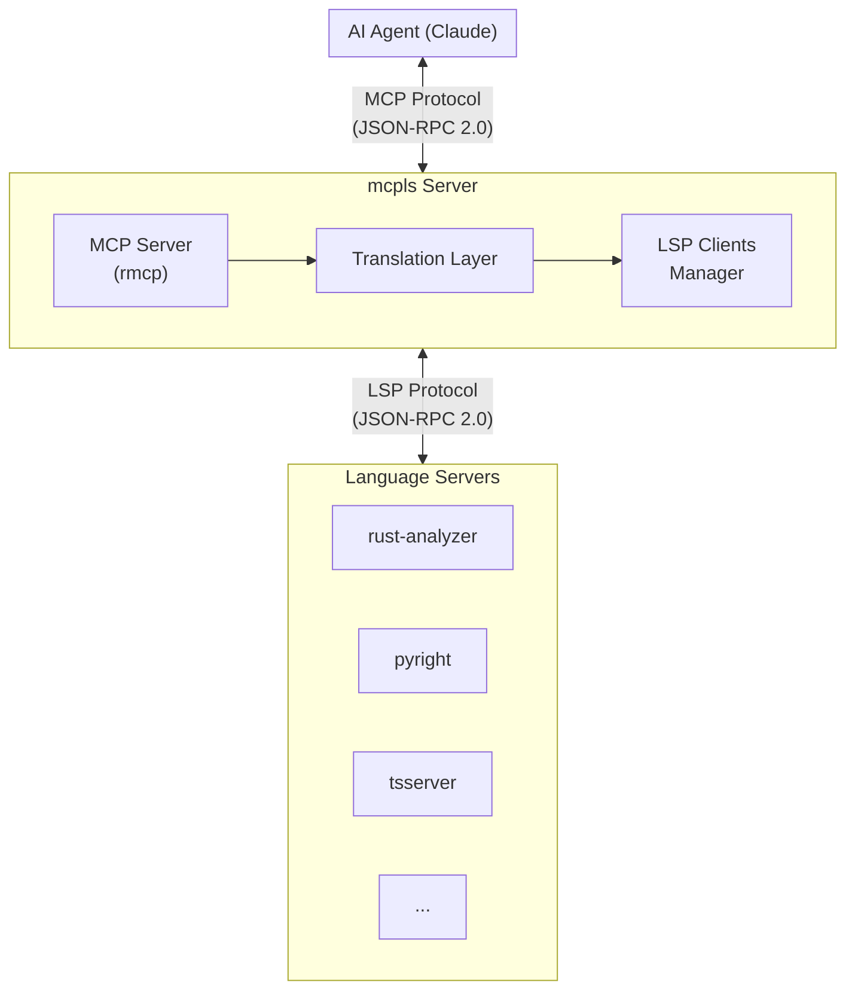

# mcpls

[](https://crates.io/crates/mcpls)
[](https://docs.rs/mcpls-core)
[](https://github.com/bug-ops/mcpls/actions)
[](https://codecov.io/gh/bug-ops/mcpls)
[](https://blog.rust-lang.org/2025/05/15/Rust-1.88.0.html)
[](LICENSE-MIT)

**Stop treating code as text. Give your AI agent a compiler's understanding.**

mcpls is a universal bridge between AI coding assistants and language servers. It exposes the full power of LSP — type inference, cross-reference analysis, semantic navigation — through the Model Context Protocol, enabling AI agents to reason about code the way IDEs do.

## Why mcpls?

AI coding assistants are remarkably capable, but they're working blind. They see code as text, not as the structured, typed, interconnected system it actually is.

**mcpls changes that.** By bridging MCP and LSP, it gives AI agents access to:

- **Type information** — Know exactly what a variable is, not what it might be
- **Cross-references** — Find every usage of a symbol across your entire codebase
- **Semantic navigation** — Jump to definitions, implementations, type declarations
- **Real diagnostics** — See actual compiler errors, not hallucinated ones
- **Safe refactoring** — Rename symbols with confidence, workspace-wide

> [!TIP]
> Zero configuration for Rust projects. Just install mcpls and rust-analyzer — ready to go.

## Installation

**Linux / macOS:**

```bash
curl -fsSL https://raw.githubusercontent.com/bug-ops/mcpls/main/scripts/install.sh | sh
```

**Windows (PowerShell):**

```powershell
irm https://raw.githubusercontent.com/bug-ops/mcpls/main/scripts/install.ps1 | iex
```

Both scripts detect your OS/architecture, download the matching release archive, verify its SHA256 checksum, and install `mcpls` to a per-user directory (`~/.local/bin` on Linux/macOS, `$HOME\.local\bin` on Windows) — no `sudo`/admin rights required.

<details>
<summary><strong>Cargo, pre-built binaries & other methods</strong></summary>

**Cargo:**

```bash
cargo install mcpls
```

**Manual download:**

Download the archive matching your platform from [GitHub Releases](https://github.com/bug-ops/mcpls/releases/latest). Each archive has a corresponding `.sha256` checksum file published alongside it — the install scripts above verify this automatically; verify manually if downloading by hand.

| Platform | Architecture | Archive |
|----------|--------------|---------|
| Linux | x86_64 | `mcpls-x86_64-unknown-linux-gnu.tar.gz` |
| Linux | aarch64 | `mcpls-aarch64-unknown-linux-gnu.tar.gz` |
| macOS | Intel | `mcpls-x86_64-apple-darwin.tar.gz` |
| macOS | Apple Silicon | `mcpls-aarch64-apple-darwin.tar.gz` |
| Windows | x86_64 | `mcpls-x86_64-pc-windows-msvc.zip` |
| Windows | ARM64 | `mcpls-aarch64-pc-windows-msvc.zip` |

**From source:**

```bash
git clone https://github.com/bug-ops/mcpls
cd mcpls
cargo install --path crates/mcpls-cli
```

</details>

<details>
<summary><strong>Prerequisites (language servers)</strong></summary>

mcpls uses graceful degradation — if one language server fails, it continues with available servers.

**Rust (rust-analyzer):**
```bash
rustup component add rust-analyzer
# Or: brew install rust-analyzer (macOS)
```

**Python (pyright, built-in default):**
```bash
npm install -g pyright
```

**Python ([ty](https://docs.astral.sh/ty/), with custom configuration):**
```bash
uv tool install ty@latest
```

**TypeScript:**
```bash
npm install -g typescript-language-server typescript
```

**Go (gopls):**
```bash
go install golang.org/x/tools/gopls@latest
```

> [!IMPORTANT]
> At least one language server must be available.

</details>

## Quick Start

**1. Configure Claude Code** (`~/.claude/claude_desktop_config.json`):

```json
{
  "mcpServers": {
    "mcpls": {
      "command": "mcpls",
      "args": []
    }
  }
}
```

**2. Experience the difference:**

```
You: What's the return type of process_request on line 47?

Claude: [get_hover] It returns Result<Response, ApiError> where:
        - Response is defined in src/types.rs:23
        - ApiError is an enum with variants: Network, Parse, Timeout

You: Find everywhere ApiError::Timeout is handled

Claude: [get_references] Found 4 matches:
        - src/handlers/api.rs:89 — retry logic
        - src/handlers/api.rs:156 — logging
        - src/middleware/timeout.rs:34 — wrapper
        - tests/api_tests.rs:201 — test case
```

## MCP Tools

<details>
<summary><strong>Code Intelligence</strong></summary>

| Tool | What it does |
|------|--------------|
| `get_hover` | Type signatures, documentation, inferred types at any position |
| `get_definition` | Jump to where a symbol is defined — across files, across crates |
| `get_references` | Every usage of a symbol in your workspace |
| `get_completions` | Context-aware suggestions that respect types and scope |
| `get_document_symbols` | Structured outline — functions, types, constants, imports |
| `workspace_symbol_search` | Find symbols by name across the entire workspace |
| `get_signature_help` | Parameter info and active signature while typing a call |
| `go_to_implementation` | Jump to implementations of a trait method or interface member |
| `go_to_type_definition` | Jump to the type definition of an expression, distinct from `get_definition` for variable bindings |
| `get_inlay_hints` | Inferred type/parameter annotations an editor would render inline |

</details>

<details>
<summary><strong>Diagnostics & Analysis</strong></summary>

| Tool | What it does |
|------|--------------|
| `get_diagnostics` | Real compiler errors and warnings, not guesses |
| `get_cached_diagnostics` | Fast access to push-based diagnostics from LSP server |
| `get_code_actions` | Quick fixes, refactorings, and source actions at a position |

</details>

<details>
<summary><strong>Refactoring & Call Hierarchy</strong></summary>

| Tool | What it does |
|------|--------------|
| `rename_symbol` | Workspace-wide rename with full reference tracking |
| `format_document` | Apply language-specific formatting rules |
| `prepare_call_hierarchy` | Get callable items at a position for call hierarchy |
| `get_incoming_calls` | Find all callers of a function (who calls this?) |
| `get_outgoing_calls` | Find all callees of a function (what does this call?) |

</details>

<details>
<summary><strong>Server Monitoring</strong></summary>

| Tool | What it does |
|------|--------------|
| `get_server_logs` | Debug LSP issues with internal log messages |
| `get_server_messages` | User-facing messages from the language server |

</details>

## Configuration

<details>
<summary><strong>Server Heuristics</strong></summary>

mcpls uses smart heuristics to spawn only relevant language servers. Each server checks for project markers before starting.

| Language | Server | Project Markers |
|----------|--------|-----------------|
| Rust | rust-analyzer | `Cargo.toml`, `rust-toolchain.toml` |
| Python | pyright | `pyproject.toml`, `setup.py`, `requirements.txt` |
| TypeScript | typescript-language-server | `package.json`, `tsconfig.json` |
| Go | gopls | `go.mod`, `go.sum` |
| C/C++ | clangd | `CMakeLists.txt`, `compile_commands.json`, `Makefile` |
| Zig | zls | `build.zig`, `build.zig.zon` |
| Nix | nixd | `flake.nix`, `shell.nix`, `default.nix`, `configuration.nix`, `home.nix` |
| Swift (Linux/macOS) | sourcekit-lsp | `Package.swift`, `project.pbxproj`, `contents.xcworkspacedata` |

> [!TIP]
> Heuristics use OR logic — if ANY marker exists, the server spawns.

**Custom heuristics:**

```toml
[[lsp_servers]]
language_id = "rust"
command = "rust-analyzer"

[lsp_servers.heuristics]
project_markers = ["Cargo.toml", "rust-toolchain.toml", ".rust-version"]
```

</details>

<details>
<summary><strong>Environment Variables</strong></summary>

| Variable | Description | Default |
|----------|-------------|---------|
| `MCPLS_CONFIG` | Path to configuration file | Auto-detected |
| `MCPLS_TRUST_PROJECT_CONFIG` | Load a `./mcpls.toml` found in the current directory | `false` |
| `MCPLS_LOG` | Log level (trace, debug, info, warn, error) | `info` |
| `MCPLS_LOG_JSON` | Output logs as JSON | `false` |

> [!NOTE]
> The two boolean flags above accept `1`/`0`, `true`/`false`, `yes`/`no`, `y`/`n`, and `on`/`off` (case-insensitive).

**Config file locations:**

| Platform | Default Location |
|----------|-----------------|
| Linux | `$XDG_CONFIG_HOME/mcpls/mcpls.toml`, else `~/.config/mcpls/mcpls.toml` |
| macOS | `~/Library/Application Support/mcpls/mcpls.toml` |
| Windows | `%APPDATA%\mcpls\mcpls.toml` |

> [!WARNING]
> A `./mcpls.toml` in the current directory is **not** loaded automatically: it
> can control which command mcpls spawns as an LSP server, so running mcpls
> against an untrusted checkout must not execute commands from that checkout
> without explicit consent. Pass `--trust-project-config` (or set
> `MCPLS_TRUST_PROJECT_CONFIG=true`) only for repositories you trust.

</details>

<details>
<summary><strong>Full Configuration Example</strong></summary>

```toml
[workspace]
roots = ["/path/to/project"]
heuristics_max_depth = 10
max_documents = 100    # 0 = unlimited
max_file_size = 10485760  # bytes, 0 = unlimited

[[lsp_servers]]
language_id = "rust"
command = "rust-analyzer"
args = []
file_patterns = ["**/*.rs"]
timeout_seconds = 30
request_timeout_seconds = 30

[lsp_servers.heuristics]
project_markers = ["Cargo.toml", "rust-toolchain.toml"]

[lsp_servers.initialization_options]
cargo.features = "all"
checkOnSave.command = "clippy"

[[language_extensions]]
extensions = ["nu"]
language_id = "nushell"
```

See [Configuration Reference](docs/user-guide/configuration.md) for all options.

</details>

## Supported Language Servers

mcpls works with any LSP 3.17 compliant server. Battle-tested with:

<details>
<summary><strong>View supported servers</strong></summary>

| Language | Server | Notes |
|----------|--------|-------|
| Rust | rust-analyzer | Zero-config, built-in support |
| Python | pyright (default), ty | Full type inference |
| TypeScript/JS | typescript-language-server | JSX/TSX support |
| Go | gopls | Modules and workspaces |
| C/C++ | clangd | compile_commands.json |
| Java | jdtls | Maven/Gradle projects |
| Zig | zls | build.zig support |
| And 24+ others | Any LSP 3.17 server | See [docs](docs/user-guide/configuration.md) |

</details>

## Architecture

<details>
<summary><strong>View architecture diagram</strong></summary>



**Key design decisions:**
- **Single binary** — No Node.js, Python, or other runtime dependencies
- **Async-first** — Tokio-based, handles multiple LSP servers concurrently
- **Memory-safe** — Pure Rust, zero `unsafe` blocks
- **Resource-bounded** — Configurable limits on documents and file sizes

</details>

## Documentation

- [Getting Started](docs/user-guide/getting-started.md)
- [Configuration Reference](docs/user-guide/configuration.md)
- [Tools Reference](docs/user-guide/tools-reference.md)
- [Troubleshooting](docs/user-guide/troubleshooting.md)
- [Agent Skill](skills/mcpls/) — packaged [Agent Skill](https://agentskills.io/specification) teaching an AI coding agent to install, configure, and run the mcpls CLI

## Development

```bash
cargo build              # Build
cargo nextest run        # Test
cargo run -- --log-level debug  # Run locally
```

**Requirements:** Rust 1.88+ (Edition 2024)

## Contributing

Contributions welcome. See [CONTRIBUTING.md](CONTRIBUTING.md) for guidelines.

## License

Dual-licensed under [Apache 2.0](LICENSE-APACHE) or [MIT](LICENSE-MIT) at your option.

---

**mcpls** — Because AI deserves to understand code, not just read it.
